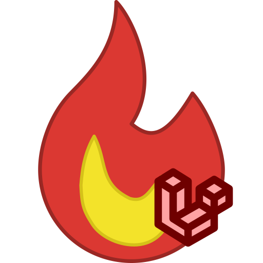

<h1 align="center">
  
  <br>
  La Flamita Cliente
  <br>
  <br>
</h1>

<p align="center">
  <a href="https://laravel.com/"></a>
  <a href="https://laravel.com/docs/10.x"></a>
  <a href="https://tailwindcss.com/"></a>
  <a href="https://flowbite.com/"></a>
</p>

> [!NOTE]
> Este es un `submodule` que forma parte del proyecto [`la-flamita`](https://github.com/InterdataUTJ/la-flamita/).

> [!IMPORTANT]
> Este proyecto solo representa el área del cliente. Puedes consultar el área administrativa desde el repositorio [`la-flamita-admin`](https://github.com/InterdataUTJ/la-flamita-admin/).

Desarrollo Web área cliente de [`Laravel`](https://laravel.com/docs/10.x) para taquería la flamita. La solución se enfoca en desarrollar toda la infraestructura web (vistas y APIs) para la logica de negocios de `la-flamita` enfocada a los clientes (el área administrativa se maneja en el proyecto [`la-flamita-admin`](https://github.com/InterdataUTJ/la-flamita-admin/)).

## Documentación 📕

### Como levantar el entono de desarrollo

1. Primero debes de asegurarte de contar con los requisitos minimos:

  - [`PHP`](https://www.php.net/releases/8.1/es.php) mínimo versión 8.1
  - [`Composer`](https://getcomposer.org/), recomendamos la ultima versión, 2.8.2.
  - [`MySQL`](https://www.mysql.com/) (_recomendamos cumplir con esta dependencia y PHP mediante [`XAMPP`](https://www.apachefriends.org/es/index.html), [`WAMP`](https://www.wampserver.com/en/) o algun software similar_).
  - [`NodeJS`](https://nodejs.org/en/) minimo versión 18 LTS (_con su respectiva instalación de [`npm`](https://www.npmjs.com/), el cual se incluye por defecto con node_).

2. Clonar el repositorio (_asegurate de tener acceso al repositorio_).

```bash
git clone https://github.com/InterdataUTJ/la-flamita-cliente.git
```

3. Navegar al directorio del repositorio

```bash
cd la-flamita-cliente/
```

4. Configurar las variables de entorno. 

_Escencialmente las unicas variables necesarias son las relacionadas al proceso de OAuth de Google y Paypal. El proyecto puede arrancar sin ellas pero no seras capaz de usar el login mediante Google ni la interfaz de Pagos._

_Ya deberia de estar bien configurado, pero asegurate de que las variables relacionadas a la base de datos sean correctas._


5. Instalar dependencias.

```bash
# Dependencias relacionadas a laravel y PHP
composer install

# Dependencias relacionadas a nodejs (tailwind, flowbite y fontawesome).
npm install
```

6. Arrancar la base de datos.

_Este proceso dependera de la instalación de BD a elegir, es completamente independiente del proyecto. El unico requisito adicional es crear la base de datos con el mismo nombre de las variables de entorno (No es necesario crear tablas manualmente)._

7. Ejecutar configuración de laravel mediante `artisan`.

```bash
# Crear los enlaces simbolicos para hacer publico parte del storage
php artisan link:storage
```

_**Nota:** Las migraciones y seeders se ejecutan desde el proyecto administrativo, por lo que recomendamos seguir la guía para configurar ambos proyectos y tener un entorno de desarrollo completo._

8. Arrancar los servidors

_Estos comandos deben de ejecutarse en terminales diferentes pues bloquean el acceso a esta._

```bash
# El proyecto depende del servidor vite para desarrollo
npm run dev

# La parte de ---host=0.0.0.0 es opcional, pero permite el uso de las API desde otros dispositivos en la LAN
php artisan serve --port=8001 --host=0.0.0.0
```

> [!NOTE]
> A pesar de que despues de levantar el servidor php la url puede decir http://0.0.0.0:8001, la web es accesible desde localhost o 127.0.0.1.


### Modulos del sistema 🧩

- Productos 🌮
- Perfil 🙂
- Ventas 💰
- Carrito 🛒

### Roles de acceso 👑

1. **Cliente** (_Solo ver peril y hacer compras_)